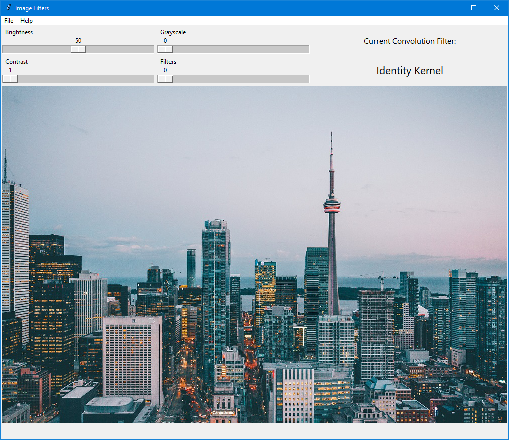

# Image Filters

An app to load images, alter the image properties such as brightness, contrast, and color/grayscale. You can also apply several different filters and save the image into an output folder.

## Motivation

I originally created this project to get a better understanding of OpenCV and TKinter. Throughout the project, I pursued further knowledge about convolution, and researched good practice when creating open source projects. This project served as a learning opportunity to improve my skills with Python. 

## Getting Started

TBA

### Prerequisites

- Python 3.6.6
- Dependencies from requirements.txt

### Installing

TBA

## Screenshots

### Welcome Image

The welcome image greets the user when the app is first opened:

### Image Editor

Once the user opens an image, the user is presented with an editor window:

### Window Menu

The user can has access to many options using the menu. Available shortcuts are also listed in the menu:

- Open an image (Gif)
- Modify image (Gif)
- Resize the window (Gif)
- Save an image (Gif)
- Logs (gif)

## Built With

- OpenCV
- TKinter
- Pillow

## Features

- Loads images in openCV compatible formats, listed below
- Switch between RGB and grayscale
- Applies changes to the image brightness & contrast
- Applies different kind of filters such as sharpness, gaussian blur, and averaging
- Saves output image to user specified location
- Program generates a detailed log file every time it is run
- Program also backs up the past five logs in case an issue has occurred in a previous run

## Compatible Formats

Although this project uses OpenCV and is theoretically able to open any OpenCV compatible image file, I decided to use the below files since they are the most common: 

- .bmp
- .dib
- .jpeg
- .jpg
- .jpe
- .png
- .pbm
- .pgm
- .ppm
- .sr
- .ras
- .tiff
- .tif

## Credits

- George Ciesinski: solo programmer on this project

## License

MIT License (see LICENSE for more information)

## Acknowledgments

- Koko: My mentor who continues to introduce me to best practice for Python development with each new project I write

& Tutorials: 

- Mohit Deshpande from zenva.com: introduced me to openCV
- John Elder from codemy.com: introduced me to TKinter
