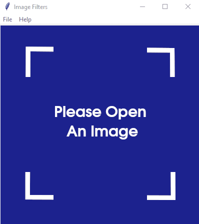

# Image Filters


An app to load images, alter the image properties such as brightness, contrast, and color/grayscale. You can also apply several different filters and save the image into an output folder.


## Motivation

This project was created to get a better understanding of OpenCV and TKinter. It also served as an opportunity to develop experience with convolution filters, libraries such as Pillow, and to practice better conventions while programming using Python. 

## Built With

- OpenCV
- TKinter
- Pillow

## Prerequisites

- Python 3.6.6
- Dependencies from requirements.txt

## Installing

1. Clone the repository
2. Navigate to the repository using terminal
3. Create a virtualenvironment, and install dependencies:

```
virtualenv -p python3 venv
source venv/bin/activate
pip install -r requirements.txt
```

Note: Feel free to skip step 2 or 3 if you manage virtual environments a different way.

4. Run the program: 

```
python app.py
```

Note: You need to run this in Python 3.X as it will not work in Python 2.X. If "python" points at Python 2.X, you will probably need to run it using the below instead: 

```
python3 app.py
```

## Screenshots

### Welcome Image and Window Menu

The welcome image greets you when the app is first opened. You have access to many options using the menu. Available shortcuts are also listed in the menu:



### Opening an Image

You can open an image by clicking Ctrl+O or File > Open:


### Image Editor

Once the user opens an image, the user is presented with an editor window:


### Resizing the Window

You can resize the window which automatically resizes the opened image while maintaining the original aspect ratio. This helps to accomodate images which are larger than the window. The resulting image only appears smaller in the window but maintains its original resolution when it is saved.


### Saving the Image

Once you are finished modifying the image, you can save it by pressing Ctrl+S or File > Save. You can type in your name followed by the extension of any OpenCV compatible image format you want to save in:


## Features

- Loads images in most openCV compatible image formats, listed below under "Compatible Formats"
- Applies conversion between RGB and grayscale
- Applies changes to the image brightness & contrast
- Applies different kind of filters such as sharpness, gaussian blur, and averaging
- Saves output image to user specified location and using the specified format

### Logs

- Image-Filters generates a detailed log file every time it is run
- Backs up the past five logs in case an issue has occurred in a previous run


### Compatible Formats

Although this project uses OpenCV and is theoretically able to open any OpenCV compatible image file, I decided to use the below files since they are the most common: 

- .bmp
- .dib
- .jpeg
- .jpg
- .jpe
- .png
- .pbm
- .pgm
- .ppm
- .sr
- .ras
- .tiff
- .tif

## Credits

- George Ciesinski: solo programmer on this project

## License

MIT License (see LICENSE for more information)

## Acknowledgments

- Daniel Koko: My mentor who continues to introduce me to best practice for Python development with each new project I write

& Tutorials: 

- Mohit Deshpande from zenva.com: introduced me to openCV
- John Elder from codemy.com: introduced me to TKinter
